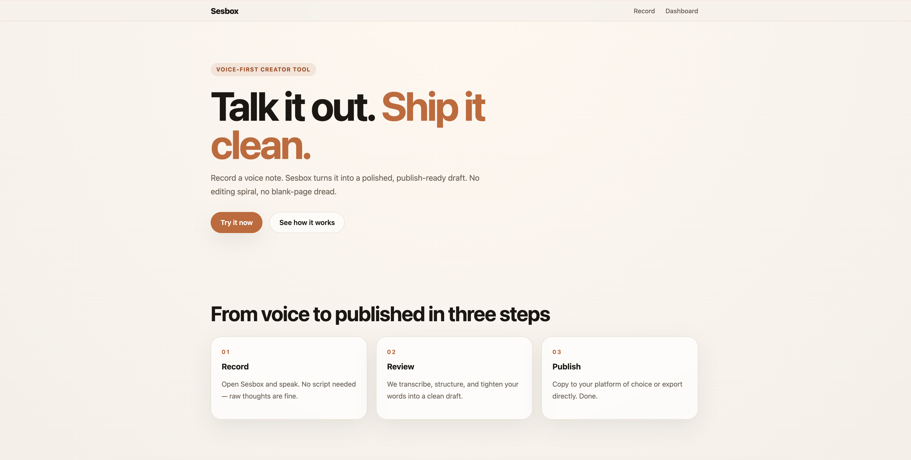
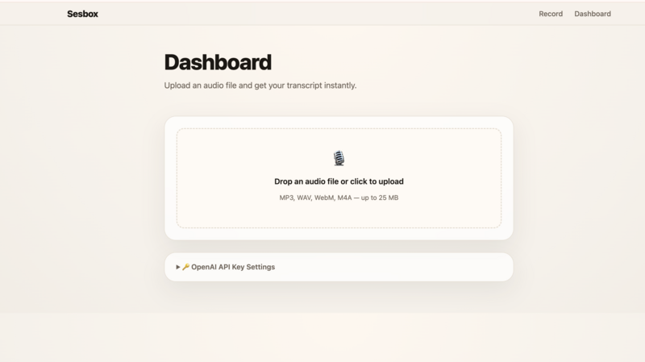
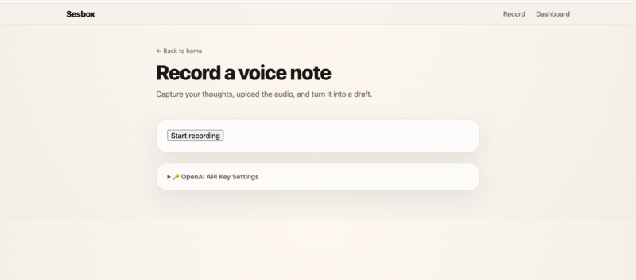

# sesbox

Voice-first creator tool — record a voice note, get a publishable draft.

## Overview

sesbox turns voice notes into structured drafts using OpenAI Whisper transcription. It's free to use — just bring your own OpenAI API key.

The product is intentionally simple:
- record a voice note
- transcribe it
- generate a draft
- approve or export the result

**Core flow:**
1. Record a voice note in the browser
2. Whisper transcribes it to text
3. Review, edit, and export the draft

## Screenshots

### Main Page


### Dashboard


### Record Interface


## Prerequisites

Before running the project locally, make sure you have:

- Node.js 18 or newer
- npm installed
- An OpenAI API key for transcription and draft generation

## Quick Start

1. Clone and install:
   ```bash
   git clone https://github.com/ForgeCoreye/sesbox.git
   cd sesbox && npm install
   ```

2. (Optional) Create `.env` with a server-side API key:
   ```
   OPENAI_API_KEY=sk-...
   ```

3. Start the dev server:
   ```bash
   npm run dev
   ```

4. Open the app → go to **Record** → enter your OpenAI API key in settings → start recording.

## Bring Your Own Key

Users can enter their own OpenAI API key directly in the browser. The key is stored in localStorage and sent via header — never logged or persisted server-side.

If a server-side `OPENAI_API_KEY` is set in the environment, it's used as a fallback.

## Deploy to Vercel

1. Push to GitHub
2. Import the repo in [vercel.com](https://vercel.com)
3. No environment variables required — users provide their own API key
4. (Optional) Set `OPENAI_API_KEY` if you want a shared fallback key

## Tech Stack

- **Next.js 15** — App Router, React 18
- **OpenAI Whisper** — `whisper-1` model for transcription
- **Vercel** — recommended deployment target

## Environment Variables

| Variable | Required | Description |
| --- | --- | --- |
| `OPENAI_API_KEY` | No | Fallback API key. Users can provide their own in the browser. |

## Architecture

sesbox uses a simple voice-to-draft pipeline:

1. Voice record  
   The user records a voice note in the app.

2. Whisper transcription  
   The audio is sent through a local adapter under `lib/` that handles the external transcription provider call. This keeps route and UI layers thin.

3. Draft generation  
   The transcript is converted into a structured draft using centralized provider logic under `lib/`.

4. Review and approve  
   The user reviews the generated draft, makes edits if needed, and approves it.

5. Export  
   The final draft can be exported for publishing or downstream use.

### Design Principles

- Keep third-party SDK usage inside local adapter modules under `lib/`
- Avoid direct SDK imports in route handlers or UI components
- Centralize provider calls so the app remains easy to test and maintain
- Keep the core user flow stable while adding new capabilities incrementally

## Project Notes

This project is focused on shipping a waitlist-ready MVP with a clean setup experience and a minimal, reliable content pipeline.

## Getting Help

If setup fails:

- confirm Node.js 18+ is installed
- verify `.env` exists and contains `OPENAI_API_KEY`
- restart the dev server after changing environment variables
- check terminal logs for runtime errors and missing configuration